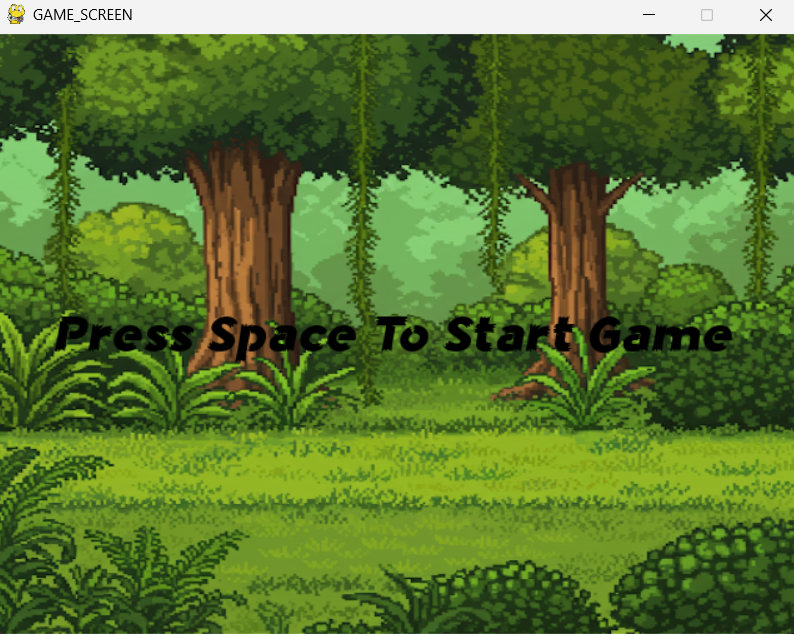
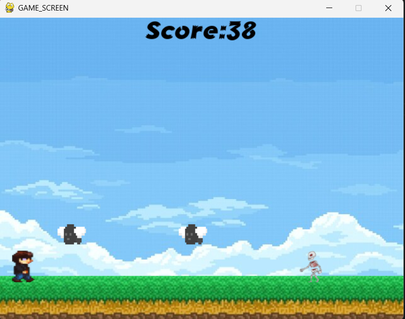
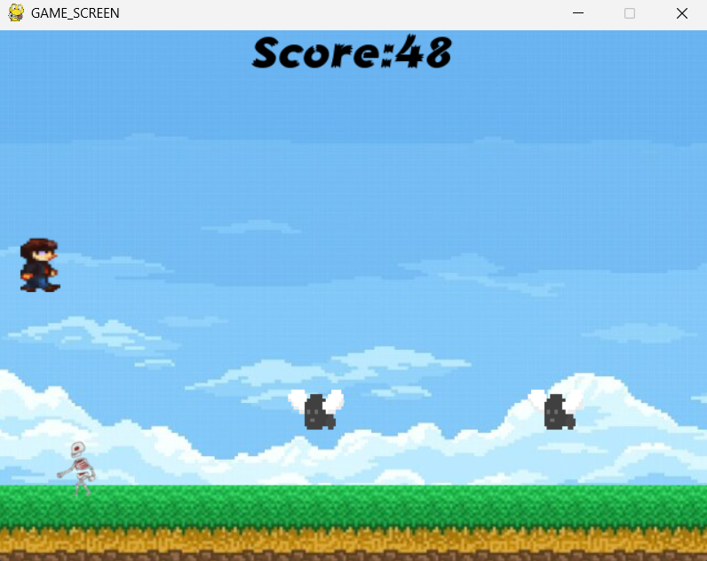
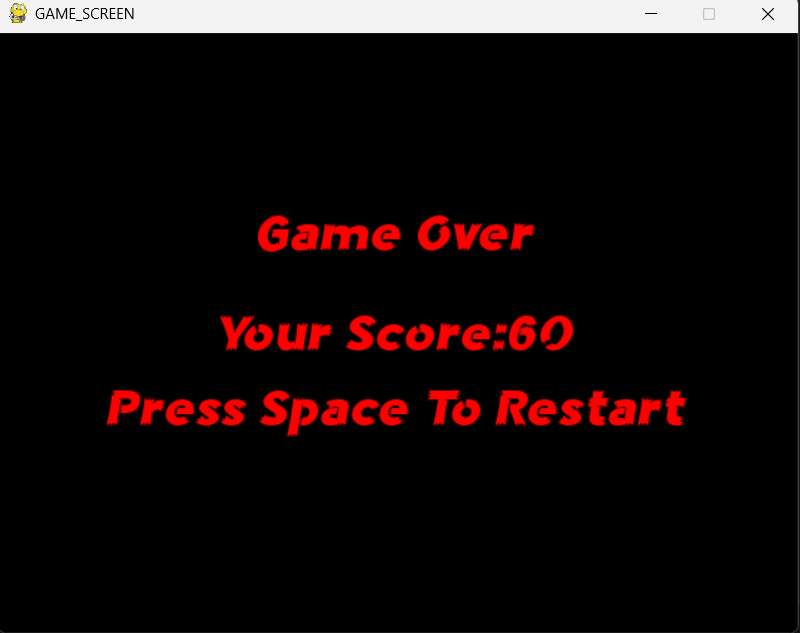

# 📚 CENG 220 Programlama Dilleri Laboratuvarı Proje Açıklaması

## 👨‍💻 Hazırlayanlar

- **Yusuf Emre Ortatepe** (22253031)  
- **Ahmet Berke Soyuçok** (23253009)

## 🎯 Proje Amacı

Bu projede temel olarak **Python** programlama dili ve **Pygame** kütüphanesini kullanarak iki boyutlu bir oyun geliştirdik.

## 📂 Dosya Yapısı

```markdown
proje-klasoru/
├── main.py                # Oyunun başlangıç dosyası
├── assets/                # Görsel ve ses dosyalarının bulunduğu klasör
│   ├── character_sprite/  # Ana karakterin sprite'larının bulunduğu klasör
│   ├── sounds/            # Arka plan ve zıplama ses efektlerinin bulunduğu klasör
│   ├── graphics/          # Arka plan, zemin ve diğer grafik ögeleri
│   └── fonts/             # Oyunda kullanılan yazı tiplerinin bulunduğu klasör
```

## ✅ Özellikler

- 🌌 Arka plan görselleri ve ses efektleri ile zenginleştirilmiş oyun ortamı
- 🧱 Engellerden kaçma ve skor sistemi
- 📈 Gerçek zamanlı çarpışma kontrolü
- 🔁 Oyunu tekrar başlatma özelliği
- 🎨 Kendi sprite ve font dosyalarımızın kullanımı

## 🖼️ Başlangıç Ekranı

 
Oyun çalıştırma tuşuna basıldıktan sonra ilk olarak ekrana başlama ekranı gelir ve space tuşuna basıldığı taktirde
oyun kodları içerisinde bulunan is_game_active değişkeni True yapılır ve oyun başlar.

## 🖼️ Oyun İçi Ekranı

 
Oyun başlatıldıktan sonra bir ana karakter ve iki adet düşman olmak üzere toplamda 3 tane karakter ve arkaplan ekrana gelir.
Düşmanlar rastgele ve 900-1200 milisaniye arasında (rastgele) bir şekilde eklenir.Skor hesabı için pygame içerisinde bulunan 
time modülü kullanılır ve oyun akışı içerisinde geçen zaman üzerinden skor hesaplanır. 

## 🖼️ Zıplama Animasyonu
 
Oyun akışı içerisinde ana karakter yerden ve havadan gelen düşmanlardan kaçınmaya çalışır,yerden gelen düşmandan kaçınmak için space tuşuna
basıldıktan sonra zıplama animasyonu aktif olur ve karakterin zıplayıp tekrardan yerine gelmesi sağlanır.

## 🖼️ Oyun Sonu Ekranı
 
Ana karakterin oyun içerisinde bulunan düşmanlardan herhangi biri ile çarpışması durumunda oyun sonlanır,oyuncunun 
elde ettiği skor ekrana verilir ve is_game_active değeri False olarak değiştirilir.Oyunu tekrardan başlatmak için
space tuşuna basılması yeterlidir, bu sayede is_game_active değişkeni tekrardan True yapılır ve oyun tekrardan başlamış olur.


